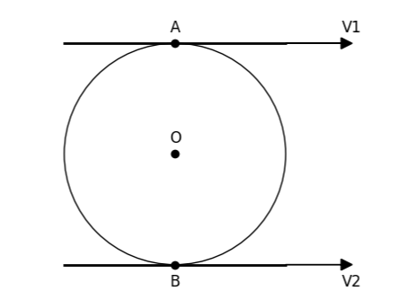

###  Условие: 

$1.4.13.$ Шестеренка радиуса $R$ помещена между двумя параллельными зубчатыми рейками. Рейки движутся со скоростью $v_1$ и $v_2$ навстречу друг другу. Какова частота вращения шестеренки? 

###  Решение: 

Перейдем в СО центра диска. В этой СО скорость верхней и нижней точек диска одинакова по модулю и противоположны по направлению. Поэтому 

$$(v_{1} - v) = - (v_{2} - v)$$

Откуда

$$v = \frac{v_{1} + v_{2}}{2}$$

Частоту вращения найдем как 

$$\nu = \frac{v}{R}$$

Подставляем $v$

$$\fbox{$\nu = \frac{v_1 + v_2}{2R}$}$$

###  Ответ: $n = (v_1 + v_2)/(2R).$

  

