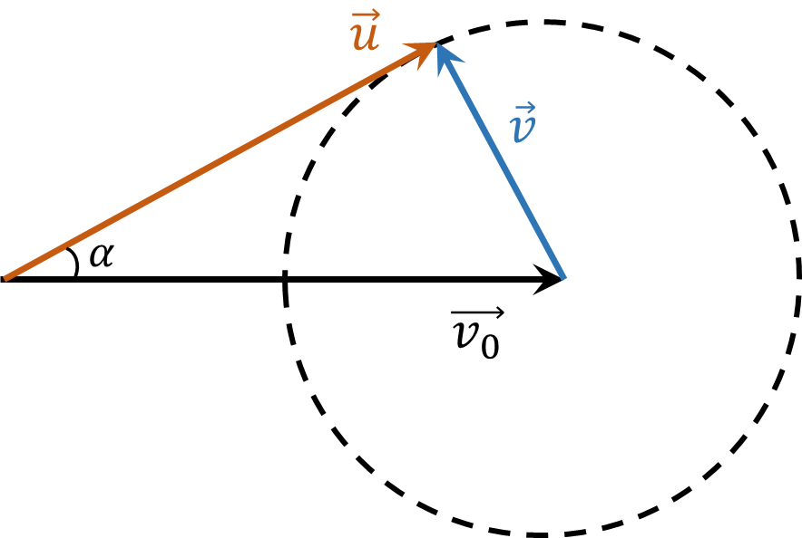

###  Условие: 

$1.4.14^*.$ Ядро, летящее со скоростью $v_0$, распадается на два одинаковых осколка. Определите максимальный возможный угол $\alpha$ между скоростями одного из осколков и вектором $\vec{v_0}$, если при распаде покоящегося ядра осколки имеют скорость $v < v_0$ 

###  Решение: 

Скорость и одно из ускорений ядра равна

$$ \vec{u} = \vec{v}_{0} + \vec{v} $$

где $ \vec{v}_{0} $ - его скорость до распада ядра, $ \vec{v} $ - скорость осколка относительно покоящегося ядра (то есть в той системе координат, в которой ядро до распада покоилось).

Расположим вектор $ \vec{v}_{0} $ так, как показано на рисунке. Конец вектора может лежать на окружности радиуса $| \vec{v} |$. 

Из рисунка видно, что вектор и составляет максимальный угол $ \alpha$ с вектором $ \vec{v}_{0} $, если угол между векторами $ \vec{u} $ и $ \vec{v} $ равен $ \pi / 2 $. В этом случае

$$\fbox{$ \alpha = \arcsin \frac{v}{v_0} $}$$

###  Ответ: $\sin\alpha = u/v$

  

