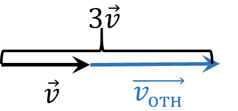
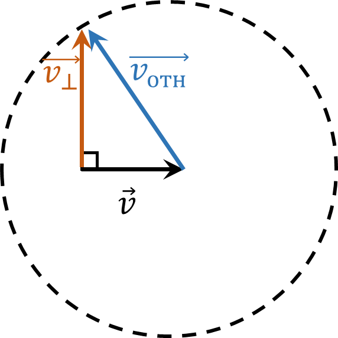

###  Условие:

$1.4.15^*.$ Имеется пучок одинаковых ядер, движущихся со скоростью $v$. Ядра в пучке самопроизвольно делятся на пары одинаковых осколков. Скорость осколков, движущихся в направлении пучка, равна $3v$. Найдите скорость осколков, движущихся в направлении, перпендикулярном пучку.

###  Решение:

Перейдем в СО центра масс пучка.

В этой системе отсчета относительная скорость связана со скоростью в НСО соотношением

$$
\vec{v'} = \vec{v} + \vec{v}_{отн}
$$

Где $\vec{v'}$ и $\vec{v}$ - скорость в НСО и скорость ЦМ системы, соответственно.

По условию, когда $\vec{v}_{отн}$ и $\vec{v}$ сонаправлены $v' = 3 v$

Откуда

$$
v_{отн} = 2v
$$

Далее рассмотрим осколки, которые полетели со скоростью $\vec{v}_\perp$)

Переходя обратно в НСО, получаем, что

$$
\vec{v}_\perp = \vec{v}_{отн}-\vec{v}
$$

По теореме Пифагора

$$
\fbox{${v}_\perp = 3{v}$}
$$

###  Ответ: $v_{макс} = v \sqrt{3}.$

###  Альтернативное решение:

