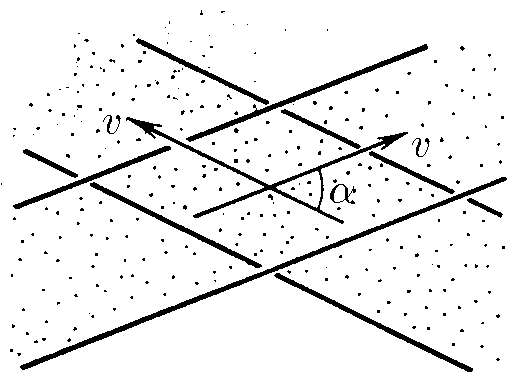

###  Условие: 

$1.4.16.$ Два пучка частиц, движущихся с одинаковой по модулю скоростью $v$, пересекаются под углом $\alpha$. Соударения частиц происходят в ограниченной области. Перейдем к системе отсчета, где скорости частиц равны по модулю и противоположны по направлению. Казалось бы, теперь область пересечения — весь объем пучков, и поэтому число соударений в единицу времени должно быть больше. Объясните получившееся противоречие. 

###  Решение: 

В новой системе отсчета геометрия пучков, а значит, и область их пересечения те же, что и раньше. Скорость частиц не обязательно направлена вдоль пучка. 

При переходе в другую систему отчета частицы также будут образовывать крест. Просто их скорости будут горизонтальны 

  

