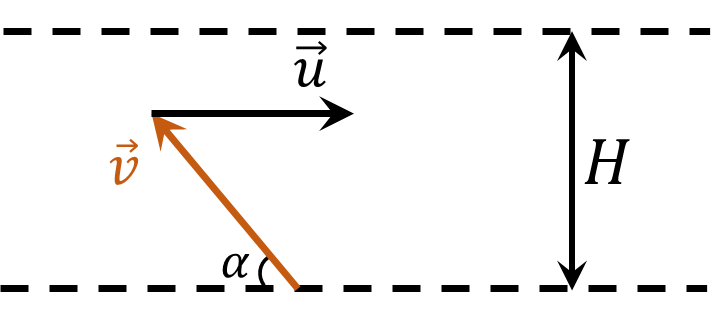

###  Условие:

$1.4.18^*.$ Мальчик, который может плавать со скоростью, в два раза меньшейскорости течения реки, хочет переплыть эту реку так, чтобы его как можно меньше снесло вниз по течению. Под каким углом к берегу он должен плыть? На какое расстояние его снесет, если ширина реки $H = 200$ м?

###  Решение:

Рассмотрим движения мальчика со скоростью $\vec{v}$, когда его сносит река с течением $\vec{u}$

Распишем в проекциях на горизонтальную и вертикальные оси, учитывая, что $u = 2v$

$$
v_x = 2v - v \cos\alpha
$$

$$
v_y = v \sin\alpha
$$

Найдем время за которое мальчик переплывет реку

$$
t = \frac{H}{v_y} = \frac{H}{v \sin\alpha}
$$

За время $t$ его снесет вдоль берега на величину

$$
L = v_xt = H\frac{2 - \cos\alpha}{\sin\alpha}\quad(1)
$$

Для того чтобы найти минимум $L$ необходимо найти экстремум функции $f(\alpha ) = \frac{2 - \cos\alpha}{\sin\alpha}$ на интервале $\alpha\in (0,\pi )$

Найдем $\alpha$, при котором производная равна $0$

$$
\frac{df}{d \alpha} = \frac{\sin^2 \alpha - \cos\alpha (2-\cos\alpha )}{\sin^2 \alpha}=0
$$

$$
1-2 \cos\alpha =0
$$

$$
\fbox{$\alpha = \pi /3$}
$$

Подставляем в $(1)$ и находим расстояние на которое его снесет

$$
\fbox{$L = H\sqrt{3}$}
$$

###  Ответ:

$\alpha = 60^{\circ}$$l = 200 \sqrt{3} \approx 345$ м

###  Альтернативное решение:

