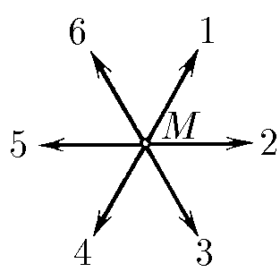
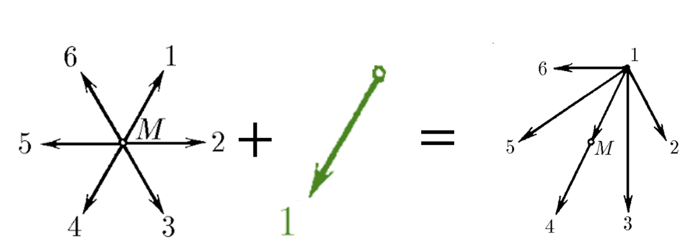
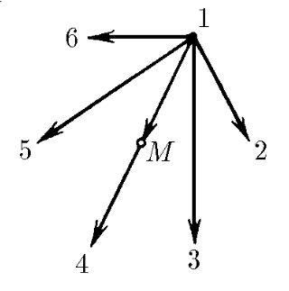

###  Условие: 

$1.4.2.$ На рисунке скорости шести выпущенных старым Мазаем зайцев изображены в системе координат, неподвижной относительно Мазая. Попробуйте нарисовать скорости Мазая и остальных зайцев в системе координат, неподвижной относительно зайца $1$. 

###  Решение: 

Чтобы перейти в ИСО связанную с первым зайцем, нужно вычесть из всех остальных векторов скоростей, вектор скорости 1-го зайца 

 

Таким, образом искомая картина скоростей выглядит так 

  Скорости зайцев в ИСО первого зайца    

