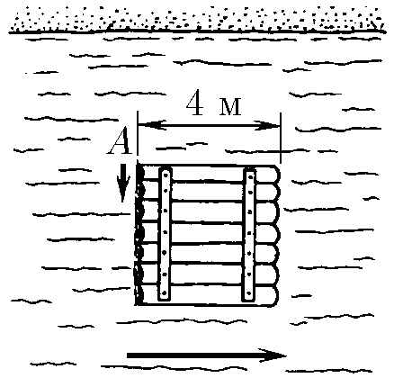
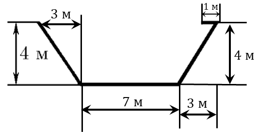

###  Условие:

$1.4.4.$ С угла $A$ квадратного плота спрыгнул в воду и поплыл вокруг плота пес. Нарисуйте траекторию движения пса относительно берега, если он плывет вдоль сторон плота, а его скорость относительно воды составляет $4/3$ скорости течения реки.

###  Решение:

Рассмотрим движение собаки относительно берега

На отрезке $AB$ собака проплывает $4\, м$ по вертикали, и ее смывает на $3\, м$ по горизантали.

Далее, на $BC$ собака проплывает $4\, м$ по горизонтали вдоль течения реки, и ее смывает на $3\, м$ в том же направлении.

На $CD$ собака плывает $4\, м$ по вертикали, но уже в другом направлении, и ее опять смывает на $3\, м$ вдоль течения реки.

На последнем отрезке, собака плывает против течения реки на $4\, м$, а река смывает на $3\, м$, делая общее перемещение в $1\, м$ против течения реки.

###  Ответ: См. рис.

###  Альтернативное решение:

