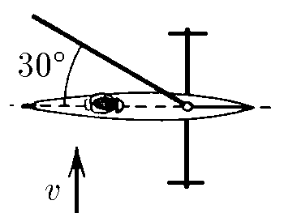
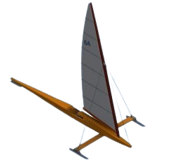

###  Условие:

$1.4.6^*.$ Буер представляет собой парусные сани. Он может двигаться лишь по линии, по которой направлены его коньки. Ветер дует со скоростью $v$, перпендикулярной направлению движения буера. Парус же составляет $30^{\circ}$ с направлением движения. Какую скорость не может превысить буер при этом ветре?

###  Решение:

###  Ответ: $v_{макс} = v \sqrt{3}.$