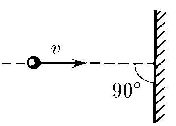

###  Условие: 

$1.4.8.$ При упругом ударе тела о неподвижную стенку его скорость $v$ меняется лишь по направлению. Определите изменение после удара скорости этого тела, если стенка движется: 
а) со скоростью $u$ навстречу телу; 
б) со скоростью $w < v$ в направлении движения тела. 

###  Решение: 

Вся суть задачи переходить в инерциальную систему связанную со стенкой, грамотно расписывая относительную скорость.

а) В случае когда стенка "догоняет" шарик, надо перейти в систему отсчета, в которой стенка покоится.

В этой системе отсчета относительная скорость шарика до удара равна

$$v_{0} + u$$

После упругого удара проекция скорости изменит знак: станет равной 

$$(- v_{0} - u).$$

Если затем вернуться в первоначальную (лабораторную) систему отсчета, где стенка движется со скоростью $u$, то здесь скорость шарика 

$${v}' = - v_{0} - 2u.$$

Изменение скорости в данном случае равно 

$$\fbox{$\Delta v = {v}' - v_{0}$ $= - 2(v_{0} + u)$}$$

б) Аналогично, надо перейти в систему отсчета, в которой стенка покоится. 

В этой системе отсчета относительная скорость шарика до удара равна $v_{0} - w$. После упругого удара проекция скорости изменит знак: станет равной 

$$(- v_{0} + w).$$

Если затем вернуться в первоначальную (лабораторную) систему отсчета, где стенка движется со скоростью $w$, то здесь скорость шарика 

$${v}' = - v_{0} + 2w.$$ 

Изменение скорости в данном случае равно 

$$\fbox{$\Delta v = {v}' - v_{0}$ $= - 2(v_{0} - w)$}$$

###  Ответ: 

a) $\Delta v = -2(v + u)$.
б) $\Delta v = -2(v - w)$. Проекция на направление начальной скорости считается положительной.