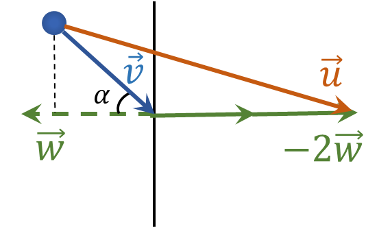

###  Условие: 

$1.4.9.$ Тело налетает на стенку со скоростью $v$ пол углом $\alpha$ к линии, перпендикулярной стенке. Определите скорость тела после упругого удара, если стенка: 
а) неподвижна; 
б) движется перпендикулярно самой себе со скоростью $w$ навстречу телу; 
в) движется под углом $\beta$ к линии, перпендикулярной ей самой, со скоростью $w$ навстречу телу

###  Решение: 

$а)$ Т.к. соударение упругое, то по Закону Сохранения Импульса:

$$v \sin\alpha = u \sin\alpha$$

$$\fbox{$v = u $}$$

$б)$ Далее эта задача немного напоминает [1.4.8](../1.4.8). 

В системе отсчета связанной со стенкой относительная скорость шарика $\vec{v_{отн}} = \vec{v} - \vec{w}$. При упругом отражении, переходя в СО земли скорость равняется $\vec{u} = \vec{v} - 2\vec{w}$. 

Ниже наглядно продемонстрирована работа с векторными величинами

Найдем проекции вектора $\vec{u}$ на горизонтальную и вертикальные оси:

$$u_y = v \sin\alpha$$

$$u_x = v \cos\alpha + 2w$$

Воспользовывшись т. Пифагора, найдем модуль вектора $\vec{u}$

$$u = \sqrt{u_x^2+u_y^2}$$

$$u = \sqrt{(v \sin\alpha )^2 + (v \cos\alpha + 2w)^2}$$

$$\fbox{$u=\sqrt{v^{2}+4vw\cos\alpha +4w^{2}}$}$$

$в)$ Аналогично предыдущему подпункту

$$\vec{u} = \vec{v} - 2\vec{w}$$

Покажем эти вектора на рисунке

Найдем проекции вектора $\vec{u}$ на горизонтальную и вертикальные оси:

$$u_y = v \sin\alpha - 2w \sin\beta$$

$$u_x = v \cos\alpha + 2w \cos\beta$$

Воспользовывшись т. Пифагора, найдем модуль вектора $\vec{u}$

$$u = \sqrt{u_x^2+u_y^2}$$

$$u = \sqrt{(v \sin\alpha - 2w \sin\beta )^2 + (v \cos\alpha + 2w \cos\beta )^2}$$

$$\fbox{$u=\sqrt{v^{2}+4vw\cos\alpha\cos\beta +4w^{2}\cos^{2}\beta}$}$$

###  Ответ: 

а) $ u=v.$ 
б) $u=\sqrt{v^{2}+4vw\cos\alpha +4w^{2}}$
в) $u=\sqrt{v^{2}+4vw\cos\alpha\cos\beta +4w^{2}\cos^{2}\beta}.$ 
  

