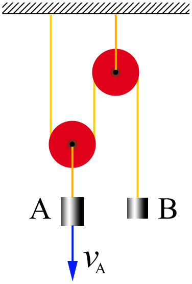

###  Условие:

$1.5.1.$ Скорость груза $A$ равна $v_a$. Чему равна скорость груза $B$?

###  Решение:

Так как нить является жесткой, нерастяжимой, то ее длина сохраняется в процессе движения грузов.

Пусть груз $B$ поднимется на расстояние равное $L$ за время $\Delta t$, тогда груз $А$ опустится на расстояние $\frac{L}{2}$ за это же время.

Это следует из того, что по обе стороны от $1$ блока нить удлинится на $\frac{L}{2}$, а значит центр блока опустится на такое же расстояние. При этом длина нити сохраняется.

Тогда с одной стороны

$$
L = v_B \cdot \Delta t
$$

а с другой

$$
\frac{L}{2} = v_A \cdot \Delta t
$$

Следовательно,

$$
v_B \cdot \Delta t = 2v_A \cdot \Delta t
$$

Скорость груза $B$ равна

$$
\fbox{$v_B = 2v_A$}
$$

###  Ответ: $v_B = 2v_A$