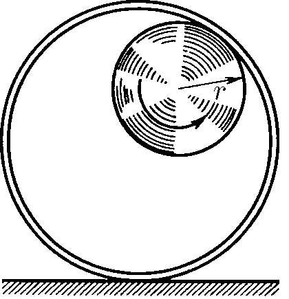

###  Условие:

$1.5.10.$ По внутренней поверхности закрепленного цилиндра радиуса $2r$ катится без проскальзывания колесо радиуса $r$. Найдите траекторию точки обода колеса

###  Решение:

Данная траектория является так называемой [Гипоциклоидой](https://ru.wikipedia.org/wiki/%D0%93%D0%B8%D0%BF%D0%BE%D1%86%D0%B8%D0%BA%D0%BB%D0%BE%D0%B8%D0%B4%D0%B0) Заданная параметричеким уравнением:

$$
\begin{gathered}\begin{cases}x=r(k-1)\left(\cos t+\frac{\cos((k-1)t)}{k-1}\right)\\\y=r(k-1)\left(\sin t-\frac{\sin((k-1)t)}{k-1}\right)&\end{cases}\end{gathered}
$$

При $r= R/2$, данная траетория ложиться на диаметр

###  Доказательство:

Пусть в начальный момент окружности касаются в точке $A$, лежащей на оси $Ox$, где точка $O$ — центр большой окружности. Координаты точки $A$ при этом - $ (kr, 0) $, где $ k = \frac{R}{r} $. Рассмотрим, как меняются координаты точки $A$, привязанной к катящейся окружности ($A$ переходит в $ A' $). Пусть маленькая окружность прокатилась так, что её центр перешел из точки $ C' $ в точку $ C'' $ и повернулся относительно точки $O$ на угол $ t $.

Во-первых, можно показать, что поворот маленькой окружности относительно своего центра при этом (т.е. угол между $ CA $ и $ C' A' $) равен $ t - kt = -(k-1)t $. Во-вторых, координаты точки $ C' $ будут такими: $ (\cos(t)(k-1)r, \sin(t)(k-1)r) $. Тогда, зная, куда перейдет центр катящейся окружности, и на какой угол она повернулась относительно этого центра, можно записать координаты точки $ A' $:

$$
\begin{cases} x = \cos(t)(k-1)r + \cos((k-1)t)r \\\ y = \sin(t)(k-1)r - \sin((k-1)t)r \end{cases}
$$

#### Ответ:

Траектория точки обода колеса проходит по диаметру цилиндра.