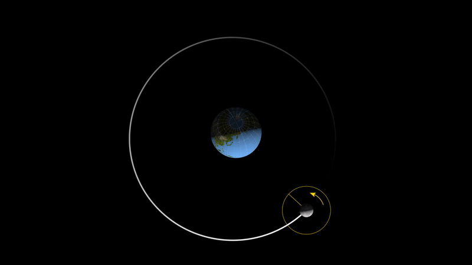

###  Условие: 

$ 1.5.11. а.$ Луна обращена к Земле постоянно одной стороной. Сколько оборотов совершит она вокруг своей оси за время полного оборота вокруг Земли? 
б. На сколько в среднем звездные сутки короче солнечных? Земля обходит Солнце за $365.25$ солнечных суток. 

###  Решение: 

а) Луна совершает один полный оборот вокруг Земли за один лунный месяц. В то же время, Луна совершает один полный оборот вокруг своей оси за этот же период. Это объясняется тем, что Луна всегда обращена к Земле одной и той же стороной из-за явления, называемого синхронным вращением. 

б) Чтобы понять разницу, необходимо учесть, что за один год (365,25 солнечных суток) Земля совершает один полный оборот вокруг Солнца. За это время Земля совершает на один оборот вокруг своей оси больше, чем количество солнечных суток в году, так как каждый день Земля должна повернуться немного больше, чтобы Солнце снова появилось на том же месте на небе. 

Земля совершает один полный оборот вокруг Солнца за 365,25 солнечных суток:

$$T_{\text{солнечных}} = 365.25$$

Число звездных суток за этот период будет на одно больше, то есть:

$$T_{\text{звездных}} = T_{\text{солнечных}} + 1 = 366.25$$ 

Рассчитаем разницу между солнечными и звездными сутками:

$$t_{\text{звездных}} = \frac{24 \cdot 365.25}{366.25}$$ 

Разница между солнечными и звездными сутками:

$$\Delta t = 24 \left( 1 - \frac{365.25}{366.25} \right) \approx 4 \text{ минуты}$$ 

NO: Более подробно [wikipedia.org](https://en.wikipedia.org/wiki/Sidereal_time)

###  Ответ: 

а. Один оборот. 
б. На 4 мин.

  

