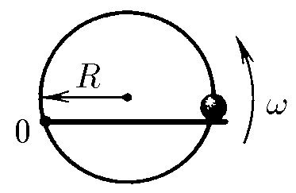
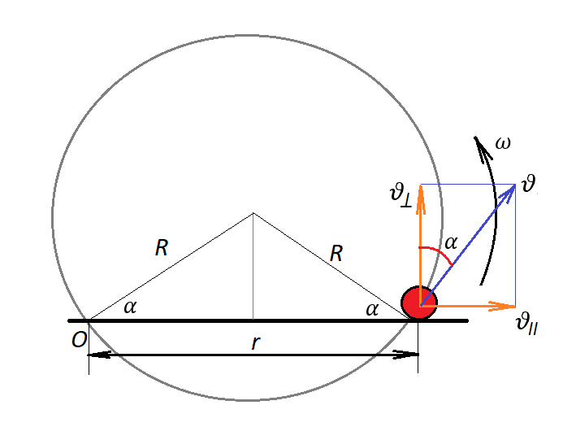

###  Условие:

$1.5.12.$ Бусинка может двигаться по кольцу радиуса $R$, подталкиваемая спицей, равномерно вращающейся с угловой скоростью $\omega$ в плоскости кольца. Ось вращения спицы находится на кольце. Определите ускорение бусинки.

###  Решение:

Бусинка будет двигаться вдоль спицы со скоростью $\upsilon_{\parallel}$, и, поскольку спица вращается, то у бусинки будет составляющая скорости, перпендикулярная спице: $\upsilon_{\perp}$

Тогда абсолютная скорость $\vec{v}$ в НСО, будет равна векторной сумме $\vec{v}_{отн}$ и $\vec{v}_{кл}$

$$
\upsilon_{\perp}=\omega r=\omega\cdot 2R\cos\alpha
$$

С другой стороны,

Тогда абсолютная скорость $\vec{v}$ в НСО, будет равна векторной сумме $\vec{v}_{отн}$ и $\vec{v}_{кл}$

$$
\upsilon_{\perp}=\upsilon\cos\alpha
$$

Так как скорость бусинки, движущейся по окружности, направлена перпендикулярно радиусу.

Тогда

$$
\omega\cdot 2R\cos\alpha =\upsilon\cos\alpha
$$

$$
\upsilon =2R\omega =\text{const}
$$

Так как скорость по модулю не меняется, то у бусинки есть только нормальное ускорение

$$
a_n=\frac{\upsilon^2}{R}=\frac{4\omega^2R^2}{R}=4\omega^2R
$$

#### Ответ: $4\omega^2R$