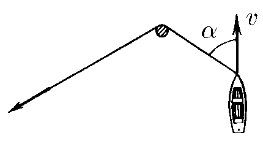
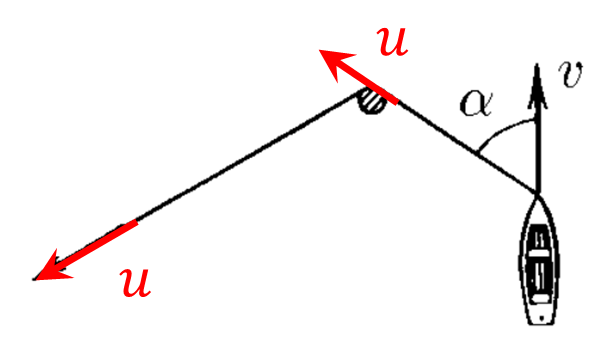

###  Условие:

$1.5.13.$ Веревку, привязанную к лодке, тянут за свободный конец таким образом, чтобы она не провисала. Лодка движется с постоянной скоростью $v$, образуя в некоторый момент времени угол $\alpha$ с отрезком веревки, находящимся между столбом и лодкой. С какой скоростью нужно тянуть в этот момент времени свободный конец веревки?

###  Решение:

Если веревка не провисает, то

$$
\fbox{$u=\upsilon\cos\alpha$}
$$

И так как все точки веревки обладают одной и той же скоростью, то тянуть веревку надо именно со скоростью $u$.

#### Ответ: $u = v \cos\alpha .$