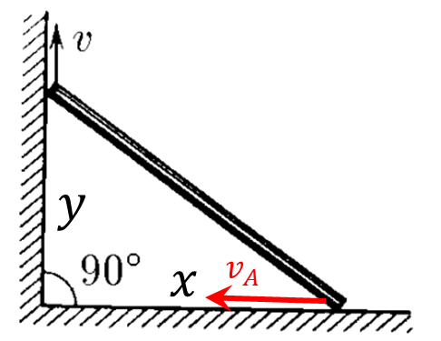

###  Условие:

$ 1.5.16.$ Стержень упирается своими концами в стороны прямого угла. Верхний конец стержня поднимают со скоростью $v$. Найдите, как зависит от времени скорость его нижнего конца. За начало отсчета времени принять момент, когда верхний конец находится в вершине угла. Длина стержня $L$.

###  Решение:

__NO__: Перед просмотром решения данной задачи, советую ознакомиться с решением [1.5.14](../1.5.14) и [1.5.15](../1.5.15)

В момент времени $t$ высота, на которую поднялся верхний конец

$$
y = v t\tag{1}
$$

Рассмотрим изменение координаты $x = \sqrt{L^2-y^2}$ за малый промежуток времени $dt$

$$
dx = \frac{ydy}{\sqrt{L^2 - y^2}}
$$

Учитывая, что $v = \frac{dy}{dt}$ и $v_A = \frac{dx}{dt}$

$$
v_A = \frac{vy}{\sqrt{L^2 - y^2}}
$$

Подставляем $(1)$

$$
\fbox{$v_A = \frac{v^2t}{\sqrt{L^2 - v^2t^2}}$}
$$

#### Ответ: $v_A = \frac{v^2t}{\sqrt{L^2 - v^2t^2}}$

###  Альтернативное решение:

Координата верхнего конца может быть найдена как

$$
y=\upsilon t
$$

Проекции скоростей обоих концов на направление стержня равны:

$$
\upsilon\cos\alpha =u\cos(90^{\circ}-\alpha )
$$

$$
\upsilon\cos\alpha =u\sin\alpha
$$

$$
u=\upsilon\operatorname{ctg}\alpha =\upsilon\frac{y}{x}
$$

По теореме Пифагора

$$
x^2+y^2=L^2
$$

$$
x=\sqrt{L^2-y^2}=\sqrt{L^2-\upsilon^2t^2}
$$

Так как скорость $u$ направлена против оси $x$, то

$$
x’=-u
$$

$$
u=-\frac{\frac{1}{2}\cdot 2t\cdot (-\upsilon^2)}{\sqrt{L^2-\upsilon^2t^2}}
$$

$$
u=\frac{t\cdot \upsilon^2}{\sqrt{L^2-\upsilon^2t^2}}
$$

Если соединить центр стержня с вершиной прямого угла, то этот отрезок будет медианой прямоугольного треугольника и равен будет половине длины гипотенузы. Получается, что центр стержня движется по окружности с центром в точке $O$.