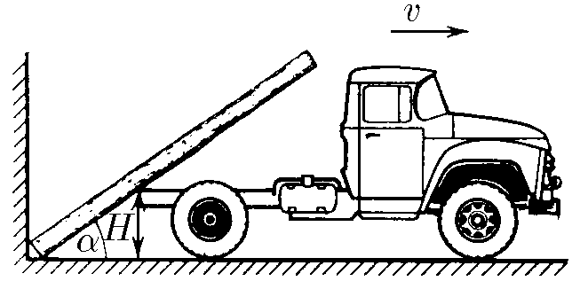
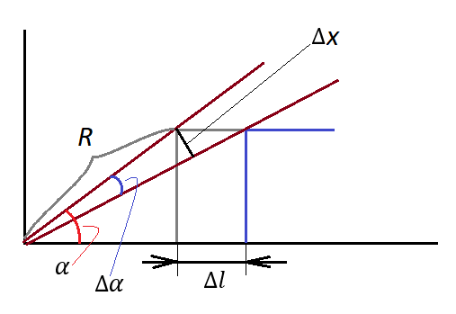

###  Условие:

$ 1.5.17.$ Бревно, упираясь нижним своим концом в угол между стеной и землей, касается дна грузовика на высоте $H$ от земли. Найдите угловую скорость бревна в зависимости от угла $\alpha$ между ним и горизонталью, если грузовик отъезжает от стены со скоростью $v$.

###  Решение:

__NO__: Перед просмотром решения данной задачи, советую ознакомиться с решением [1.5.16](../1.5.16)

В момент времени $t$ автомобиль проедет расстояние путь $vt$ и дно будет иметь горизонатальную координату $x$

$$
x = H \tan\alpha\quad(1)
$$

Рассмотрим изменение угла $\alpha = \arctan \frac{H}{x}$ за малый промежуток времени $dt$

$$
d\alpha = d\left(\arctan \frac{H}{x}\right)
$$

$$
d\alpha = \frac{1}{1+\frac{H^2}{x^2}} \frac{H}{x^2}
$$

$$
d\alpha = dx\frac{H}{x^2+H^2}
$$

Учитывая, что $\omega = \frac{d \alpha}{dt}$ и $v = \frac{dx}{dt}$

$$
\omega = \frac{vH}{x^2+H^2}
$$

Подставляем $(1)$

$$
\omega = \frac{v}{H(1 + \tan^2 \alpha )}
$$

$$
\fbox{$\omega = \frac{v \sin^2 \alpha}{H}$}
$$

###  Ответ: $\omega = \frac{v \sin^2 \alpha}{H}$

###  Альтернативное решение:

За время $\Delta t$ грузовик отъедет на расстояние

$$
\Delta l=\upsilon\Delta t
$$

При этом бревно чуть опустится, повернувшись на малый угол $\Delta \alpha$. Если длина дуги поворота $\Delta x$, то по определению радианной меры угла

$$
\Delta \alpha =\frac{\Delta x }{R}
$$

Угловая скорость определяется как

$$
\omega =\frac{\Delta \alpha}{\Delta t }=\frac{\Delta x }{R\Delta t }
$$

Но $\Delta x =\upsilon\Delta t\sin\alpha$.

$$
\omega =\frac{\upsilon\Delta t\sin\alpha}{R\Delta t }=\frac{\upsilon\sin\alpha}{R}
$$

Также можно записать, что

$$
H=R\sin\alpha
$$

С учетом этого

$$
\omega =\frac{\upsilon\sin^2 \alpha}{H}
$$