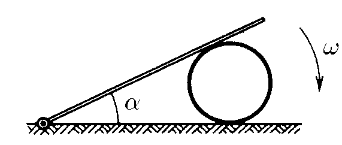

###  Условие:

$ 1.5.18^*.$ Стержень, одним концом шарнирно закрепленный на горизонтальной плоскости, лежит на цилиндре. Угловая скорость стержня $\omega$. Проскальзывания между цилиндром и плоскостью нет. Найдите зависимость угловой скорости цилиндра от угла $\alpha$ между стержнем и плоскостью.

###  Решение:

__NO__: Перед просмотром решения данной задачи, советую ознакомиться с решением [1.5.17](../1.5.17)

К моменту времени $t$ стержень будет составлять угол $\alpha$

Рассмотрим изменение координаты $x = AC$ за малый промежуток времени $dt$

$$
dx = d\left(\frac{R}{\tan (\frac{\alpha}{2})}\right)
$$

Делим обе части на $dt$

$$
\frac{dx}{dt} = \frac{d\left(\frac{R}{\tan\alpha /2}\right)}{dt}
$$

Учитывая, что $\omega = \frac{d \alpha}{dt}$ и $v = \frac{dx}{dt}$

$$
v = \frac{\omega R}{2 \sin^2 (\frac{\alpha}{2})}
$$

Запишем условие отсутсвия проскальзывания

$$
\omega ' R = v
$$

Отсюда

$$
\fbox{$\omega ' = \frac{\omega}{2 \sin^2 (\frac{\alpha}{2})}$}
$$

###  Ответ: $\omega_0 = \omega /2 \sin^2 (\alpha /2)$

###  Альтернативное решение:

