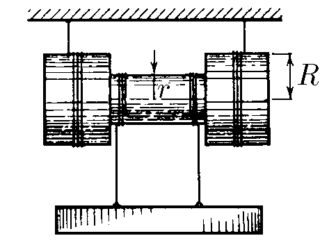

###  Условие:

$1.5.2.$ Угловая скорость катушки равна $\omega$, радиус внутреннего цилиндра $r$, а радиус внешних цилиндров $R$. Каковы скорости оси катушки и груза относительно земли?

###  Решение:

Рассмотрим мгновенную ось вращения, проходящую через точку $O_1$, тогда скорость оси катушки равна

$$
\fbox{$v_к = \omega R$}
$$

Для нахождения скорости груза рассмотрим скорость т.$O$ как суперпозицию скоростей поступательного движения со скоростью центра колеса и скорости вращения т.$O$ относительно центра колеса.

$$
\vec{v_O} = \vec{v_к} + \vec{v_в}
$$

$$
v_O = v_к – v_в = \omega R - \omega r = \omega\cdot (R - r)
$$

Любая точка нити, в силу ее не растяжимости, имеет одинаковую скорость, следовательно, скорость груза

$$
\fbox{$v_г = v_O = \omega\cdot (R - r)$}
$$

###  Ответ: $v_к = \omega R$; $v_г = \omega (R - r)$