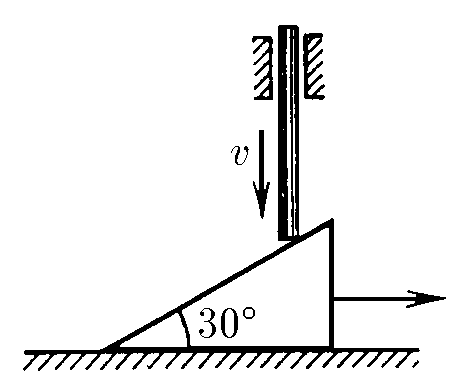
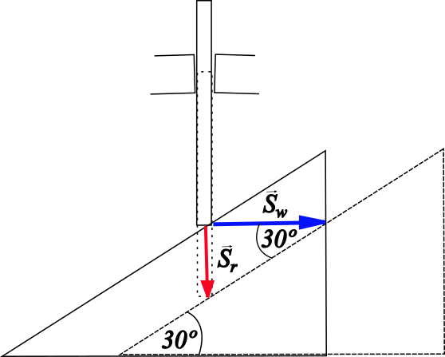

###  Условие: 

$1.5.3$ Клин, имеющий угол $30^{\circ}$, лежит на горизонтальной плоскости. Вертикальный стержень, опускающийся со скоростью $v$, заставляет клин скользить по этой плоскости. Какова скорость клина? 

###  Решение: 

Во-первых, мы предполагаем, что трение отсутствует. Для лучшего понимания проблемы рассмотрим следующий рисунок

 

Согласно чертежу 

$$\tan{30^\circ}=\frac{S_r}{S_w}$$ 

и это соотношение справедливо и для скоростей, поскольку движение равномерное (с постоянной скоростью) 

$$\tan{30^\circ}=\frac{v}{v_w}=\frac{\sqrt{3}}{3}$$  Таким образом, выражая $v_w$

$$\boxed{v_w=v\sqrt{3}}$$ 

###  Ответ: $v_w=v\sqrt{3}$

  

