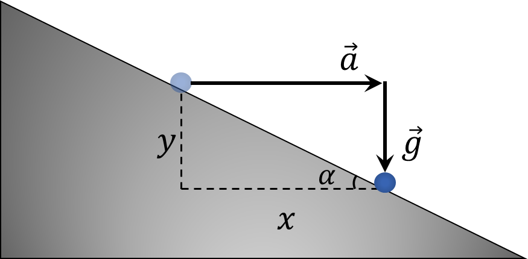

###  Условие:

$1.5.4.$ На клине с углом $\alpha$ лежит монета. С каким наименьшим ускорением должен двигаться клин по горизонтальной плоскости, чтобы монета свободно падала вниз?

###  Решение:

За промежуток времени $t$ монета изменила свою горизонатальную и вертикальную координаты на $x$ и $y$, соответсвенно

Учитывая горизонтальное ускорение $a$ и ускорение свободного падения $g$, найдем $x$ и $y$

$$
x = \frac{at^2}{2}
$$

$$
y = \frac{gt^2}{2}
$$

Учитывая, что тело не отрывалось от клина

$$
y = x \tan\alpha
$$

Откуда

$$
\fbox{$a = g \text{ ctg} \alpha$}
$$

###  Ответ: $a = g \text{ ctg} \alpha$