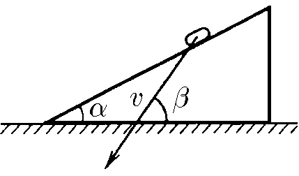

###  Условие: 

$1.5.5^*.$ Скорость монеты, соскальзывающей с клина, изображена на рисунке. Графическим построением найдите скорость клина 

###  Решение: 

Монета имеет скорость $\vec{v}_{отн}$, направленную под углом $\alpha$ к горизонту, в инерциальной системе отсчета клина, который движется горизонтально со скоростью $\vec{v}_{кл}$.

Тогда абсолютная скорость $\vec{v}$ в НСО, будет равна векторной сумме $\vec{v}_{отн}$ и $\vec{v}_{кл}$

$$\vec{v} = \vec{v}_{кл} + \vec{v}_{отн}$$

###  Альтернативное решение: 

   

