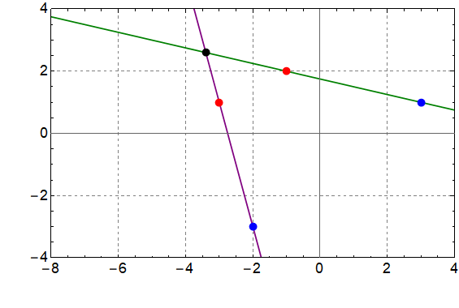

###  Условие:

$1.5.6.$ Плоское твердое тело вращается вокруг оси, перпендикулярной его плоскости. Координаты начального положения точек $A$ и $B$ этого тела $(−1,\\; 2)$ и $(3,\\; 1)$, а конечного — $(−3,\\;1)$ и $(−2,\\; -3)$. Графическим построением найдите координаты оси вращения.

###  Решение:

Т.к. ось вращения неподвижна, то все точки тела вращаются вокруг неё и перпендикулярны по направлению.

Если координаты двух точек в начале и в конце равны $A$, $B$ и $A'$, $B'$ соответственно, то если провести линии $AB$ и $A'B'$ точка их пересечения будет центром вращения

По построениям эта точка имеет координаты $(-3.4,\\; 2.6)$

#### Ответ: $(-3.4,\\; 2.6)$

###  Решение 2:

Геометрически ось вращения должна быть равноудалена от концов отрезка $A$$A'$ и также равноудалена от концов отрезка $B$$B'$.
Фактически, ось вращения есть пересечение серединных перепендикуляров к отрезкам $A$$A'$ и $B$$B'$.

По построению эта точка имеет координаты $(-2.8,\\; 3.1)$.

Если необходимо, приведу аналитическое решение нахождения оси вращения.

#### Ответ: 

$$(-2.8,\\; 3.1)$$

