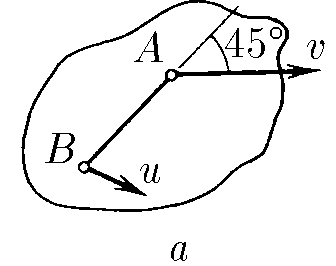
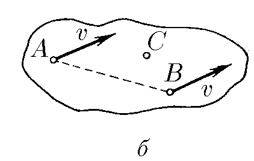

###  Условие:

$1.5.7.$ а. Скорость точки $A$ твердого тела равна $v$ и образует угол $45^{\circ}$ с направлением прямой $AB$. Скорость точки $B$ этого тела равна $u$. Определите проекцию скорости точки $B$ на направление $AB$.

б. Скорости точек $A$ и $B$ твердого тела равны $v$. Скорость точки $C$, находящейся в плоскости прямой $AB$ и вектора $v$, равна $u > v$. Найдите проекцию скорости точки $C$ на ось, перпендикулярную указанной плоскости.

###  Решение:

a) Если расстояния между двумя взятыми точками неизменны, значит если спроецировать скорость точки $A$ на прямую $AB$, то и проекция скорости точки $B$ на прямую $AB$ точно такая же

$$
\fbox{$u_{AB} = v/\sqrt{2}$}
$$

б) Скорости $A$ и $B$ одинаковы потому что либо тело не вращается, либо его вращение происходит вокруг линии $AB$.

Факт того, что скорость точки $C$ имеет другое значение, говорит о том, что её скорость $\vec u$ складывается из скорости $\vec v$ в плоскости рисунка и $\vec u_1$ перпендикулярно плоскости.

$$
\vec{u}_1+\vec{v} = \vec{u}
$$

Откуда

$$
\fbox{$u_1 = \sqrt{u^2 - v^2}$}
$$

#### Ответ:

а. $u_{AB} = v/\sqrt{2}$.
б. $u_1 = \sqrt{u^2 − v^2}$.