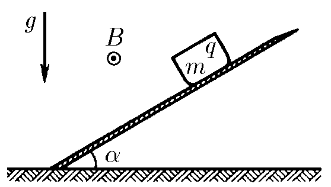
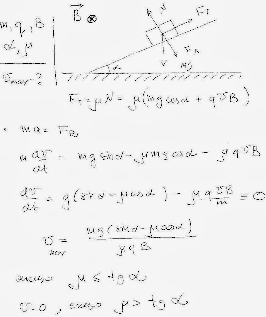

###  Условие:

$10.1.20.$ Определите, какую максимальную скорость разовьет заряженное тело, скользящее по наклонной плоскости в магнитном поле индукции $B$ и в поле тяжести. Масса и заряд тела $m$ и $q$. Магнитное поле параллельно наклонной плоскости и перпендикулярно полю тяжести. Угол наклона плоскости к горизонту $\alpha$. Коэффициент трения о плоскость $\mu$.

###  Решение:

####  Ответ: $v=\frac{mg}{qB\mu}(\sin\alpha-\mu\cos\alpha)$ при $\mu\leqslant\operatorname{tg}\alpha;v=0$ при $\mu>\operatorname{tg}\alpha.$