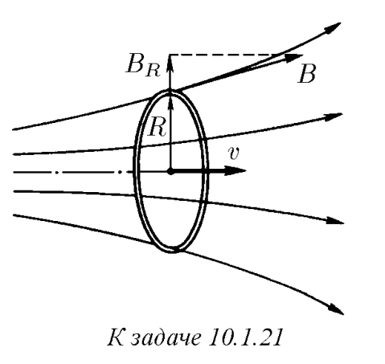
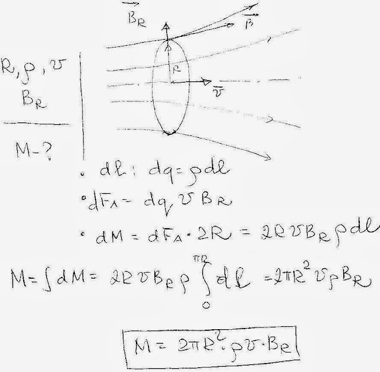

###  Условие: 

$10.1.21.$ Равномерно заряженное кольцо радиуса $R$, линейная плотность заряда которого $\rho$, движется соосно аксиально-симметричному магнитному полю со скоростью $v$. Радиальная составляющая индукции магнитного поля на расстоянии $R$ от оси равна $B_R$. Определите момент сил, действующих на кольцо. 

 

###  Решение: 

 

###  Ответ: $ M = 2\pi R^2\rho vB_R.$ 
