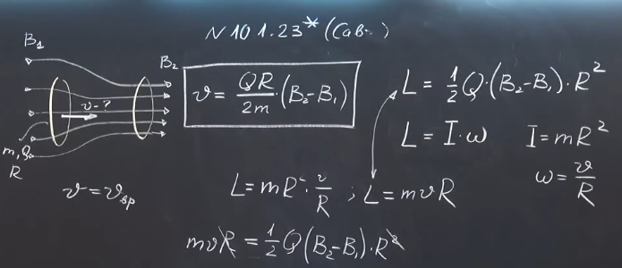

###  Условие:

$10.1.23^{∗}.$ Какую минимальную скорость нужно сообщить равномерно заряженному непроводящему кольцу, расположенному соосно аксиально-симметричному полю, вдоль оси этого поля, чтобы кольцо переместилось из области однородного магнитного поля $B_1$ в область однородного поля $B_2$, $B_2 > B_1$? Радиус кольца $R,$ заряд $Q,$ масса $m$.

###  Решение:

#### Ответ: $v = Q(B_2 − B_1)R/(2m)$