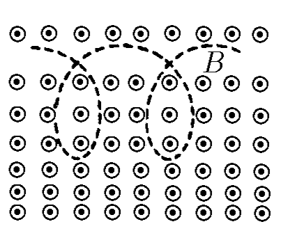
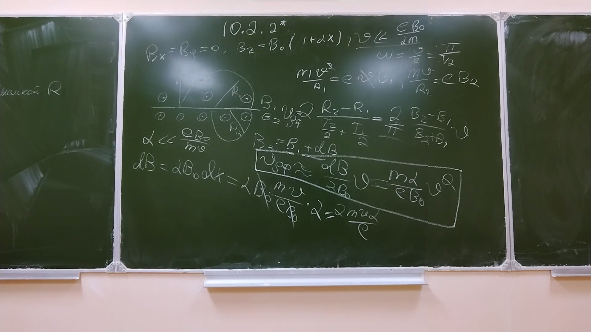

###  Условие:

$10.2.2^{∗}.$ Оцените скорость дрейфа электрона поперек неоднородного магнитного поля, компоненты индукции которого $B_x = 0,$ $B_y = 0,$ $B_z = B_0(1 + \alpha x)$. Скорость электрона $v,$ $v \ll eB_0/(\alpha m_e)$.

###  Решение:

#### Ответ: $. v_{др} \approx \alpha m_ev^2/(eB_0)$