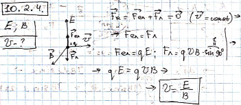

###  Условие:

$10.2.4.$ Взаимно перпендикулярные электрическое и магнитное поля называются скрещенными. Какую начальную скорость должна иметь заряженная частица в направлении, перпендикулярном обоим полям, чтобы ее движение в скрещенных полях оставалось прямолинейным? Напряженность электрического поля $E$, индукция магнитного поля $B$.

###  Решение:

###  Ответ: $v = E/B$