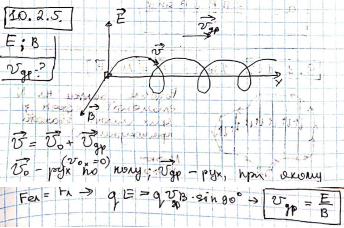

###  Условие: 

$10.2.5.$ В скрещенных электрическом и магнитном полях $E$ и $B$ частица «дрейфует» поперек обоих полей. Чему равна дрейфовая скорость частицы? 

###  Решение: 

 

###  Ответ: $v_{др} = E/B$ 
