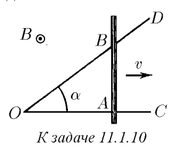

###  Условие: 

$11.1.10^{∗}.$ Металлический стержень $AB$, сопротивление единицы длины которого $\rho$, движется с постоянной скоростью $v$, перпендикулярной $AB$, замыкая два идеальных проводника $OC$ и $OD$, образующих друг с другом угол $\alpha$. Длина $OC$ равна $l$ и $AB ⊥ OC$. Вся система находится в однородном постоянном магнитном поле индукции $B$, перпендикулярном плоскости системы. Найдите полное количество теплоты, которое выделится в цепи за время движения прута от точки $O$ до точки $C$ 

 

###  Решение: 

 

 

###  Ответ: $W = B^2l^2v \, \tan\alpha /(2\rho )$ 

### 
