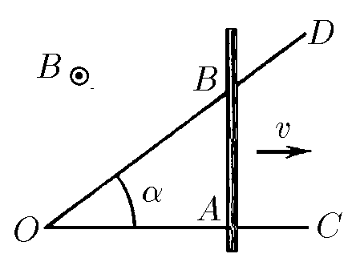
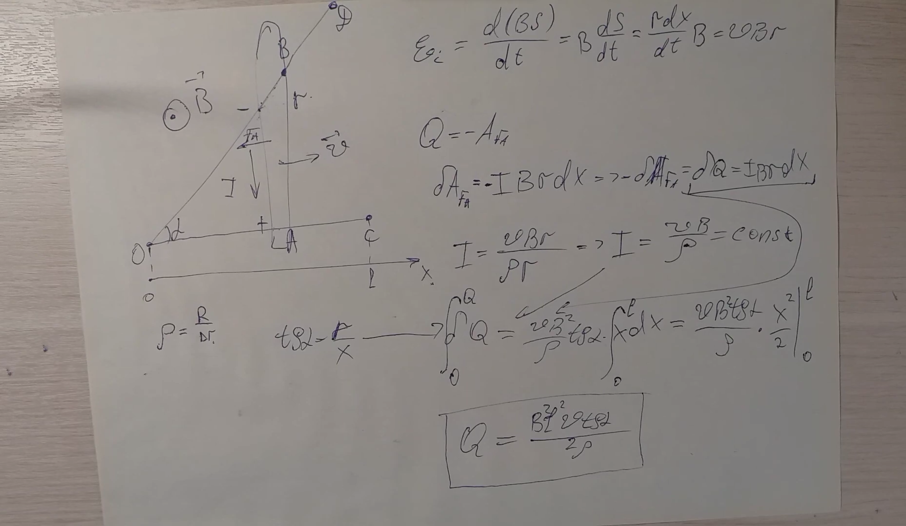

###  Условие:

$11.1.10^{∗}.$ Металлический стержень $AB$, сопротивление единицы длины которого $\rho$, движется с постоянной скоростью $v$, перпендикулярной $AB$, замыкая два идеальных проводника $OC$ и $OD$, образующих друг с другом угол $\alpha$. Длина $OC$ равна $l$ и $AB ⊥ OC$. Вся система находится в однородном постоянном магнитном поле индукции $B$, перпендикулярном плоскости системы. Найдите полное количество теплоты, которое выделится в цепи за время движения прута от точки $O$ до точки $C$

###  Решение:

Через время $t$ металлический стержень $AB$ проедет расстояние

$$
x = vt\tag{1}
$$

При этом длина стержня $AB$, соединяющая точки касания идеального проводника

$$
AB = x \tan\alpha\tag{2}
$$

При этом сопротивление проводника составит

$$
R = \rho \cdot AB =  \rho vt \tan\alpha\tag{3}
$$

Площадь заметаемая проводником за время $dt$

$$
dS = AB dx = AB v dt = v^2t \tan\alpha ~dt\tag{4}
$$

При этом изменение магнитного потока $d \Phi$

$$
d \Phi = B ~dS = v^2Bt \tan\alpha ~dt\tag{5}
$$

ЭДС самоиндукции, возникающая в проводнике

$$
\varepsilon = \frac{d \Phi}{dt} = v^2Bt \tan\alpha\tag{6}
$$

По закону Джоуля-Ленца, количество выделенной теплоты $dQ$ за время $dt$

$$
\frac{dQ}{dt} = \frac{\varepsilon^2}{R} = \frac{v^3B^2t \tan\alpha}{\rho}\tag{7}
$$

Время $t_0$ за которое стержень пройдёт со скоростью $v$ от точки $O$ до точки $C$

$$
t_0 = \frac{l}{v}\tag{8}
$$

Полная энергия, выделенная за время $t_0$

$$
Q=\int_0^{t_0}dQ\tag{9}
$$

Подставляем в подинтегральное выражение, мощность выделения теплоты $(7)$

$$
Q=\int_0^{t_0} \frac{v^3B^2t \tan\alpha}{\rho} dt\tag{10}
$$

Вынося константу, решаем:

$$
Q= \frac{v^3B^2 \tan\alpha}{\rho} \int_0^{t_0} t~dt = \frac{v^3B^2 \tan\alpha}{\rho} \frac{t_0^2}{2}\tag{11}
$$

Подставляем время $t_0$ из уравнения $(8)$

$$
Q = \frac{v^3B^2 \tan\alpha}{\rho} \frac{l^2}{2v^2} = \frac{B^2l^2v \tan\alpha}{2\rho }\tag{12}
$$

####  Ответ: $W = B^2l^2v \, \tan\alpha /(2\rho )$

### Альтернативное Решение:

