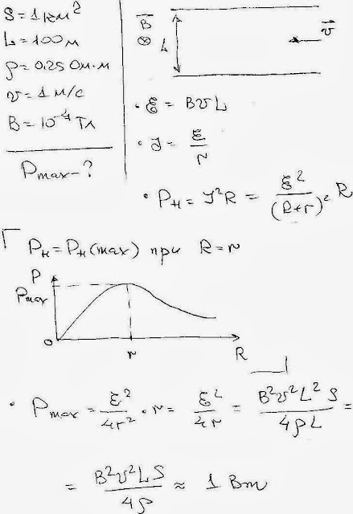

###  Условие: 

$11.1.11.$ В одном из фантастических романов предлагался проект электростанции, использующей энергию морских течений и магнитное поле Земли. В океан погружены две горизонтальные металлические пластины площади $S = 1 \,км^2,$ расположенные на расстоянии $L = 100 \,м$ одна над другой. Морская вода, обладающая удельным сопротивлением $\rho = 0.25 \,Ом\cdotм$, течет с востока на запад со скоростью $v = 1 \,м/с$. Магнитное поле Земли в данном месте однородно, направлено с юга на север, а индукция этого поля $B = 10^{−4} \,Тл$. В результате между пластинами появляется напряжение, а если их соединить проводами с внешней нагрузкой, то в ней выделяется мощность. Определите максимальную мощность, которую можно получить таким образом. 

###  Решение: 

 

###  Ответ: $ N = (vB)^2 SL/(4\rho ) $$= 1 \,Вт$ 
