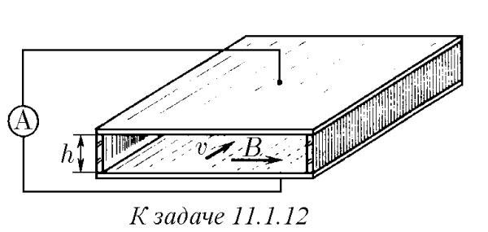
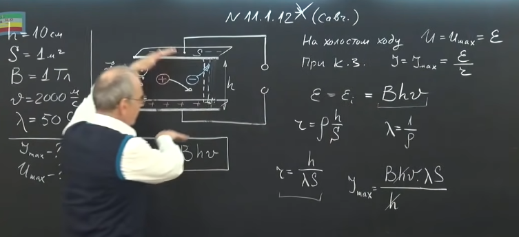
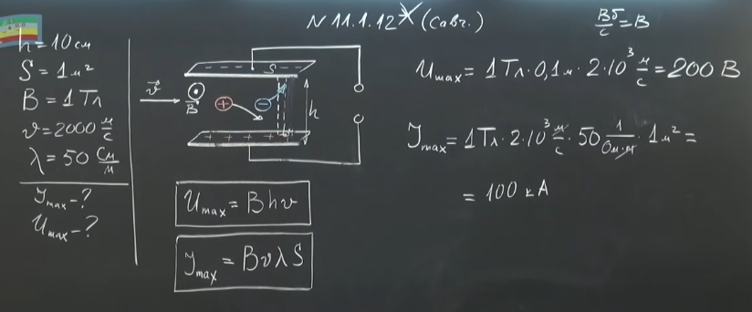

###  Условие: 

$11.1.12^{∗}.$ В магнитогидродинамическом генераторе между плоскими параллельными электродами, расположенными на расстоянии $h = 10\,см$ друг от друга движется раскаленный газ, проводимость которого пропорциональна плотности. Площадь каждого электрода $S = 1\,м^2$. Магнитное поле генератора параллельно пластинам и перпендикулярно газовому потоку, индукция этого поля $B = 1\,Тл$. При входе в генератор скорость газа $v = 2000\,м/с$, проводимость $λ = 50\,См/м$. Определите максимальный ток и максимальное напряжение генератора. 

 

###  Решение: 

 

 

 

###  Ответ: $I = λBvS = 10\,кА,$ $V = vBh = 200\,В$ 
