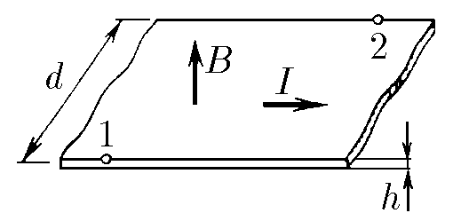
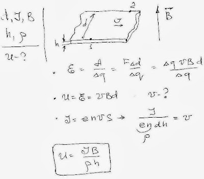

###  Условие:

$11.1.13.$ По проводящей ленте ширины $d$ течет ток $I$. Лента находится в магнитном поле индукции $B$. Направление поля перпендикулярно ее плоскости. Найдите разность потенциалов между точками $1$ и $2$ ленты, если ее толщина равна $h$, а объемная плотность заряда носителей тока на ней равна $\rho$.

###  Решение:

#### Ответ: $V = IB/(\rho h)$