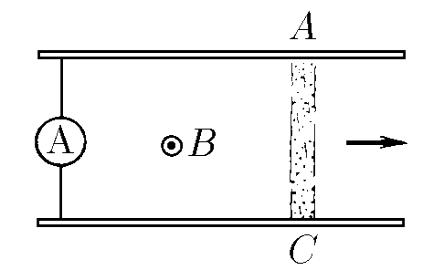

###  Условие:

$11.1.14.$ а. Ускоритель плазмы (рельсотрон) состоит из двух параллельных массивных проводников (рельсов), лежащих в плоскости, перпендикулярной магнитному полю индукции $B$. Между точками $A$ и $C$ в водороде поджигают электрический разряд. Ток $I$ в разряде поддерживается постоянным. Под действием магнитного поля область разряда (плазменный сгусток) перемещается, разгоняясь к концам рельсов и срываясь с них. Чему равна скорость плазменного сгустка, если его масса $m$? Расстояние между рельсами $l$. Длина участка, на котором происходит ускорение плазмы, равна $L$.
б. Решите задачу для случая $B = 1 \,Тл$, $l = 0.1 \,м$, $L = 1 \,м$, $I = 10 \,А$; в плазменном сгустке содержится $10^{13}$ ионов водорода.

###  Решение:

На промежутке длины $L$ на плазменный сгусток действует постоянная сила

$$
F_A = IBl
$$

Тогда, из Закона Сохранения Энергии

$$
\frac{mv^2}{2} = F_AL
$$

$$
\frac{mv^2}{2} = IBlL
$$

Откуда находим скорость

$$
\boxed{v=\sqrt{\frac{2BIlL}{m}}}
$$

####  Ответ:

$$
\mathrm{a.~}v=\sqrt{2BIlL/m}
$$

$$
{6.~}v\approx1,1\cdot10^{7} \mathrm{~M/c.}
$$