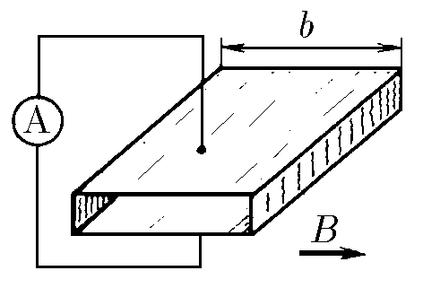
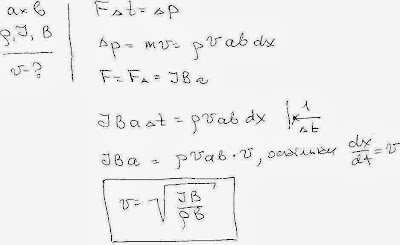

###  Условие:

$11.1.15.$ В трубе прямоугольного сечения $a × b$ находится газ плотности $\rho$. Вертикальные стенки трубы — изоляторы, горизонтальные — электроды. В одном из концов трубы зажигают разряд, после чего ток $I$ поддерживается постоянным. Возникшая область горения разряда магнитными силами вталкивается внутрь трубы, «сгребая» перед собой газ. Определите установившуюся скорость плазменной «пробки», считая, что она все время больше скорости звука в газе. Магнитное поле индукции $B$ перпендикулярно вертикальным стенкам трубы.

###  Решение:

####  Ответ: $v = \sqrt {IB/(\rho b)}$