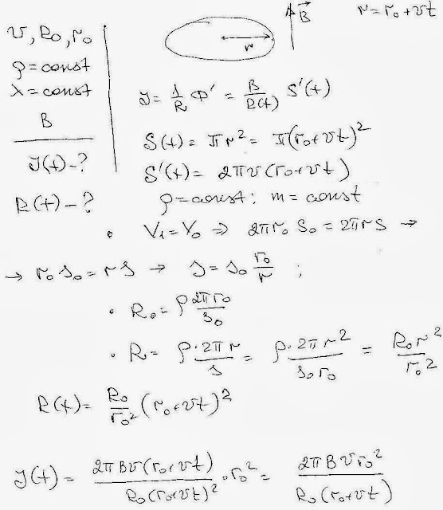

###  Условие: 

$11.1.16.$ Тонкое проводящее кольцо помещено в магнитное поле $B$, перпендикулярное плоскости кольца. Радиус кольца увеличивается с постоянной скоростью $v$. Определите зависимость тока в кольце от времени, если в начальный момент сопротивление кольца $R_0$, а радиус кольца $r_0$. Плотность и проводимость материала кольца при растяжении не меняются. 

###  Решение: 

 

####  Ответ: 

$$
I_t=2\pi r_0^2Bv/[R_0(r_0+vt)]
$$