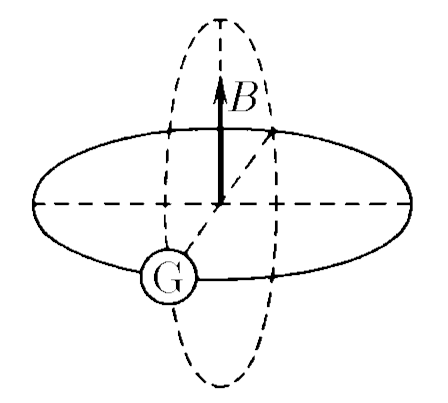

###  Условие:

$11.1.17. $ Виток площади $S$ расположен перпендикулярно магнитному полю индукции $B$. Он замкнут через гальванометр с сопротивлением $R$. Какой заряд протечет через этот гальванометр, если виток повернуть параллельно полю?

###  Решение:

$$
U=  \frac{d\Phi}{dt} = \frac{BdS}{dt} = \frac{BS sin(\phi)d\phi}{dt}
$$

$$
I= \frac{dq}{dt}=\frac{U}{R} = \frac{BS sin(\phi)d\phi}{Rdt}
$$

$$
\int_{0}^{q}dq=\int_{0}^{\pi/2}\frac{BS sin(\phi)d\phi}{R}
$$

$$
q = \frac{BS}{R}(cos(0)-cos(\pi/2))=\frac{BS}{R}
$$

#### Ответ: $ q = BS/R$