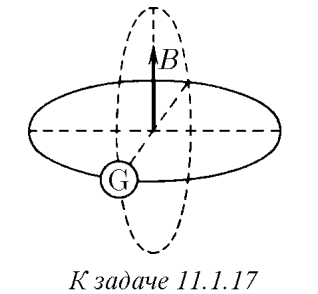

###  Условие: 

$11.1.17. $ Виток площади $S$ расположен перпендикулярно магнитному полю индукции $B$. Он замкнут через гальванометр с сопротивлением $R$. Какой заряд протечет через этот гальванометр, если виток повернуть параллельно полю? 

 

###  Решение: 

$\Delta \Phi = BS$ $\Delta q = \frac{\Delta \Phi}{R} $$= \frac{BS}{R}$ 

###  Ответ: $ Q = SB/R$ 
