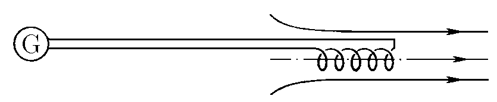
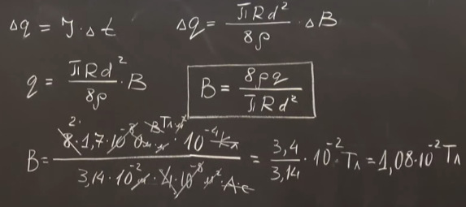

###  Условие:

$11.1.18^{∗}.$ Катушка датчика магнитного поля изготовлена из медного провода диаметра $0.2\,мм$. Радиус катушки $1\,см$. Удельное сопротивление $1,7 \cdot 10^{−8}\,Ом\cdotм$. Датчик определяет индукцию магнитного поля по заряду, который протекает через катушку, замкнутую на гальванометр, когда ее вносят в магнитное поле так, что ось катушки совпадает с направлением поля. Определите индукцию магнитного поля, если через гальванометр, когда катушку внесли в поле, протек заряд $10^{−4}\,Кл$.

###  Решение:

#### Ответ: $ B = 1.1 \cdot 10^{-2}\,Тл$