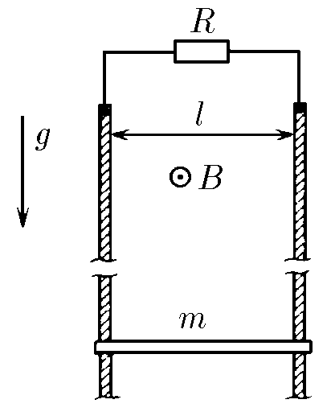

###  Условие: 

$11.1.19.$ В однородном магнитном поле индукции $B$ находятся две вертикальные рейки, расположенные в плоскости, перпендикулярной линиям поля. По рейкам, расстояние между которыми равно $l$, может скользить проводник массы $m$. Определите установившуюся скорость этого проводника, если верхние концы реек замкнуты на сопротивление $R$. В какие виды энергии переходит работа силы тяжести? 

###  Решение: 

 

###  Ответ: $v = gmR/(Bl)^2$. В тепло. 
