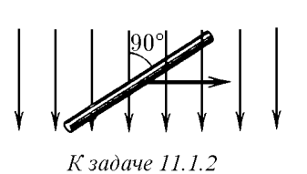
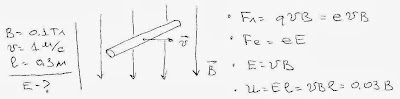

###  Условие: 

$11.1.2.$ Поперек магнитного поля индукции $0.1 \,Тл$ движется со скоростью $1 \,м/с$ прямой провод длины $0.3 \,м$. Чему равно напряжение электрического поля между концами проводника? 

 

###  Решение: 

 

###  Ответ: $V = 0.03 \,В$ 
