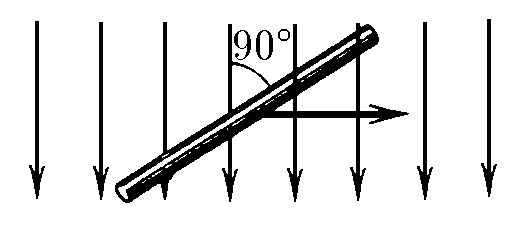

###  Условие:

$11.1.2.$ Поперек магнитного поля индукции $0.1 \,Тл$ движется со скоростью $1 \,м/с$ прямой провод длины $0.3 \,м$. Чему равно напряжение электрического поля между концами проводника?

###  Решение:

Сила Лоренца действует на заряд $q$ в проводнике:

$$
F_Л = qvB \tag{1}
$$

Сила со стороны электрического поля на заряд $q$:

$$
F_e = qE \tag{2}
$$

Так как провод движется равномерно, то внешниe силы скомпенсированны:

$$
F_Л = F_e \Rightarrow E = vB \tag{3}
$$

Напряжение между концами проводника:

$$
U=E\ell \tag{4}
$$

Подставляем выражение для $E$ из $(3)$ в $(4)$

$$
U=vB\ell = 0.03 \mathrm{~В} \tag{5}
$$

###  Ответ: $V = 0.03 \mathrm{~В}$