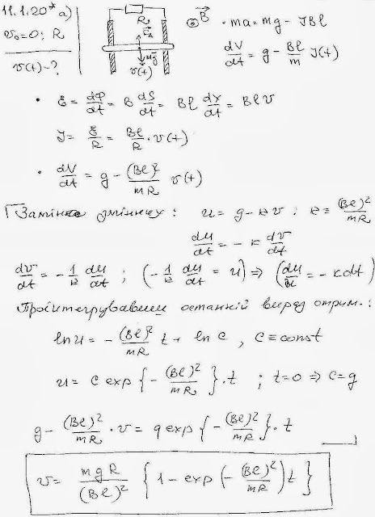
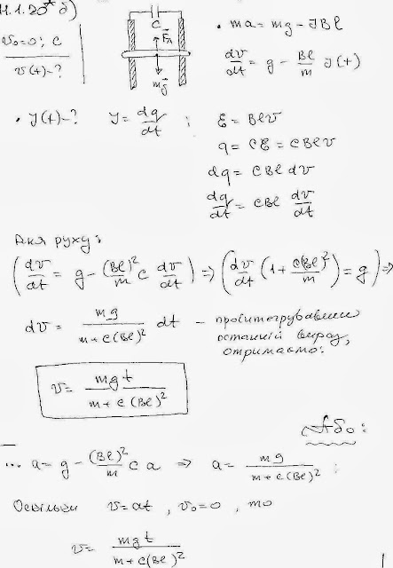
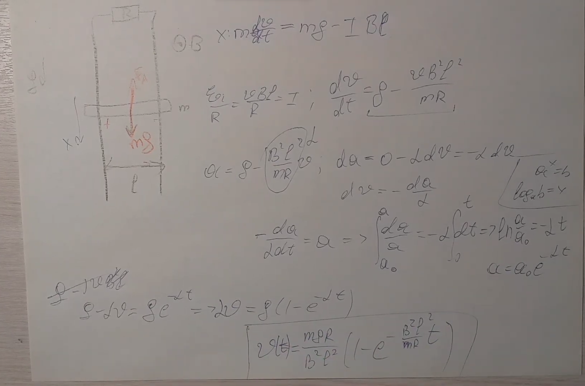
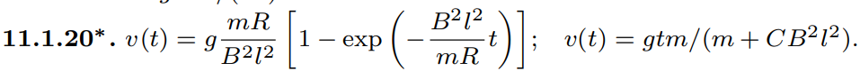

###  Условие: 

$11.1.20^{∗}.$ Определите в задаче [11.1.19](../11.1.19) зависимость скорости проводника от времени при нулевой начальной скорости в случае, когда верхние концы реек замкнуты: а) на сопротивление $R$; б) на емкость C 

###  Решение: 

 

 

###  Альтернативное решение: 

 

 

###  Ответ: 

### 

 
