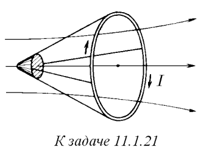

###  Условие: 

$11.1.21.$ В осесимметричном магнитном поле тело можно ускорять, поддерживая в витке, связанном с телом и ориентированном перпендикулярно оси симметрии поля, постоянный ток $I$. Докажите, что приращение кинетической энергии тела вместе с витком пропорционально приращению магнитного потока через виток, и найдите коэффициент пропорциональности. 

 

###  Решение: 

Из Теоремы о Кинетической Энергии: $\Delta K = A$ $A = I \cdot \Delta \Phi$ Отсюда: $\Delta K = I \cdot \Delta \Phi$ Коэфицент пропорциональности: $I$ 

###  Ответ: $k = I$ 
