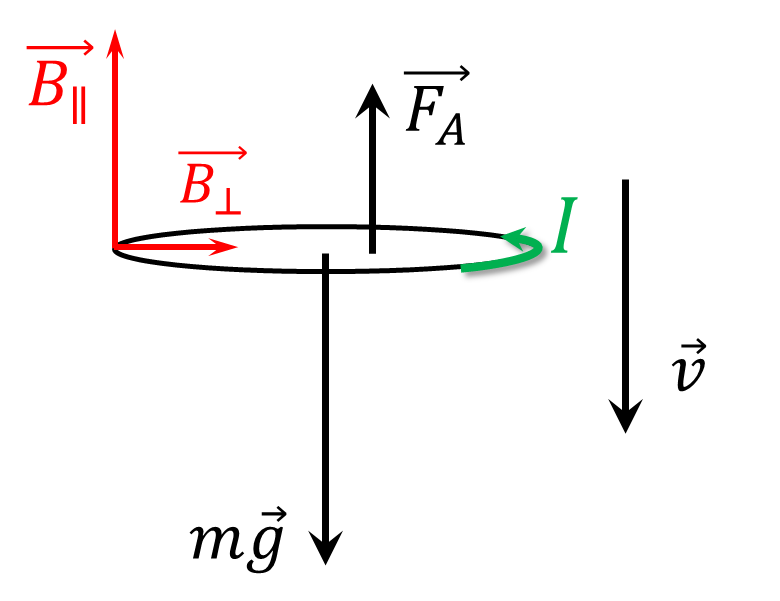

###  Условие:

$11.1.22^*.$ В магнитном поле с большой высоты падает кольцо радиуса $a$ и массы $m$. Сопротивление кольца $R$. Плоскость кольца все время горизонтальна. Найдите установившуюся скорость падения кольца, если вертикальная составляющая индукции магнитного поля изменяется с высотой по закону $B = B_0(1+\alpha h)$.

###  Решение:

Кольцо будет лететь с потоянной скоростью, потому что сила Ампера $F_A$ будет компензировать силу тяжести $mg$

Через теорему о магнитном потоке, найдем тангенциальную составляющую магнитной индукции

$$
B_\parallel = - \frac{dB_\perp}{dh} \frac{a}{2}= - \frac{a}{2} \frac{d}{dh}(B_0(1+\alpha h))
$$

Учитывая, что установившаяся скорость постоянна

$$
v=\text{const}
$$

$$
\frac{dh}{dt} = -v
$$

Откуда находим значение для тангенциальной составляющей магнитной индукции $B_\parallel$

$$
B_\parallel = \frac{\alpha aB_0}{2}
$$

Из-за того, что поток проходящий через кольцо изменяется, в кольце индуцируется ток

$$
\varepsilon_{i} = -\frac{d\Phi}{dt}=-\pi a^2 \frac{dB_\perp}{dt}
$$

$$
\varepsilon_{i} = \pi a^2 B_0v\alpha
$$

По закону Ома, индуцированный ток найдём как

$$
I = \frac{\varepsilon_{i}}{R} = \frac{\pi a^2 B_0v\alpha}{R}
$$

Тогда силу Ампера найдем как

$$
F_A = 2\pi aIB_\parallel
$$

$$
F_A = 2\pi a \frac{\pi a^2 B_0v\alpha}{R} \frac{\alpha aB_0}{2}
$$

$$
F_A = \frac{\pi^2 a^4 B_0 ^2v \alpha^2}{R}
$$

Условие отсутствия ускорения

$$
mg = F_A
$$

$$
\frac{\pi^2 a^4 B_0 ^2v \alpha^2}{R} = mg
$$

Откуда получаем установившуюся скорость

$$
\boxed{v = \frac{mgR}{(B_0\pi a^2\alpha )^2}}
$$

__NO__: Более развернутую и красивую задачу с похожей идеей можно найти в ["Очень длинных физических задачах"](https://belphol.github.io/books/LongProblemsPart2.pdf) А.И.Слободянюка "Как гроб Магомета" (Задача 13)

####  Ответ:

$$
v = \frac{mgR}{(B_0\pi a^2\alpha )^2}
$$

###  Альтернативное решение:

