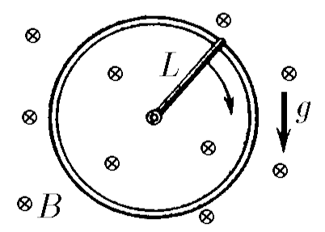
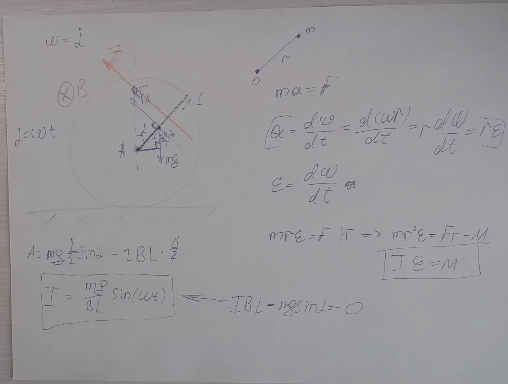

###  Условие:

$11.1.23^{∗}.$ В поле тяжести помещено вертикально металлическое кольцо. Металлический стержень длины $L$ и массы $m$ шарнирно закреплен в центре кольца и касается его другим концом. Однородное магнитное поле индукции $B$ перпендикулярно плоскости кольца. По какому закону надо менять ток в стержне, чтобы стержень вращался равномерно с угловой скоростью $\omega$, если в начальный момент стержень находился в верхнем положении? Трением пренебречь.

###  Решение:

###  Альтернативное решение:

####  Ответ: $I = (mg/BL) \cos{\omega t}$