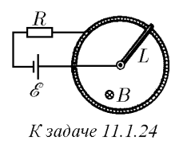
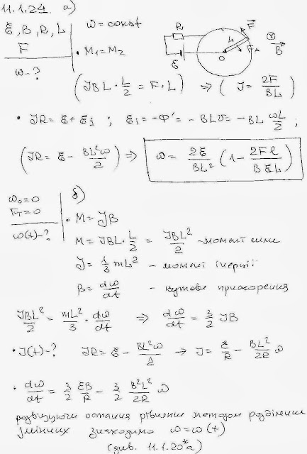
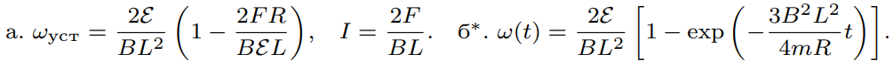

###  Условие: 

$11.1.24.$ На рисунке изображена модель двигателя постоянного тока. ЭДС батареи $E$, индукция магнитного поля $B$, сопротивление цепи $R$, длина перемычки $L$. а. Определите установившуюся угловую скорость перемычки и ток в цепи, если сила трения в подвижном контакте $F$. б*. Найдите зависимость угловой скорости перемычки от времени, если ее начальная скорость равна нулю, а трением можно пренебречь. 

 

###  Решение: 

 

###  Ответ: 

 
