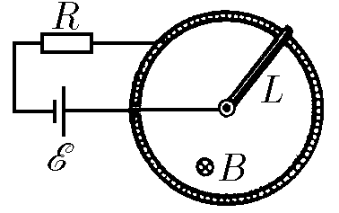

###  Условие: 

$11.1.24.$ На рисунке изображена модель двигателя постоянного тока. ЭДС батареи $E$, индукция магнитного поля $B$, сопротивление цепи $R$, длина перемычки $L$. а. Определите установившуюся угловую скорость перемычки и ток в цепи, если сила трения в подвижном контакте $F$. 
б*. Найдите зависимость угловой скорости перемычки от времени, если ее начальная скорость равна нулю, а трением можно пренебречь. 

###  Решение: 

 

####  Ответ: $\mathrm{а.~}\omega_{\mathrm{уст}}=\frac{2\mathcal{E}}{BL^{2}}\left(1-\frac{2FR}{B\mathcal{E}L}\right),\quad I=\frac{2F}{BL}.$ $\mathrm{б^*.~}\omega(t)=\frac{2\mathcal{E}}{BL^{2}}\left[1-\exp\left(-\frac{3B^{2}L^{2}}{4mR}t\right)\right]$

